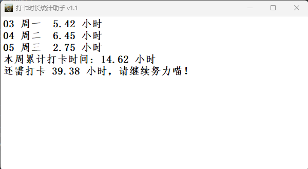

### AttendanceStatisticsAssistant  v1.1
得力e+ APP打卡时间统计工具

### 仅用于统计打卡时长，无其他功能
相较于1.1版,1.2版本更新内容如下

 - 新增chromedriver自动更新功能,自动下载的chromedriver缓存地址为 C:\Users\\(用户名)\\.wdm\drivers\chromedriver\win64\
 - 更新同一时间段内超过两次打卡时的计算规则，新规则计算间隔时间最长的两次打卡时间间隔
 - 新增上周打卡时间显示
 - 更慢的启动:(

相较于1.0版,1.1版本更新内容如下

 - 修复了list out of range问题
 - 修复了当前周跨月时的计算错误
 
#### 使用方法
- 在本仓库的release中下载zip压缩包并解压  
  https://github.com/secret2base/AttendanceStatisticsAssistant/releases/tag/v1.1
- 在同目录下新建userInformation.txt文件，并将手机号和密码分别写入userInformation.txt文件的第一行和第二行
- 下载chromedriver.exe (1.2版本自行下载，无需手动更新)
在 https://googlechromelabs.github.io/chrome-for-testing/#stable 或 http://chromedriver.storage.googleapis.com/index.html 下载chromedriver.exe  
chromedriver的版本与当前Chrome版本保持一致，本工程内的chromedriver为116.版本  
将下载好的chromedriver也放入与exe文件相同的文件夹中  
ps. 基于Chrome内核实现，请确保电脑已安装Chrome
- 双击exe文件即可运行，运行时请关闭网络代理工具
#### 示意图

#### 其他

 - 基于selenium和requests实现，运行时会调用Chrome，通常需要5-6秒显示界面，请耐心等待
 - 注意 本地的驱动缓存地址为 C:\Users\\(用户名)\\.wdm\drivers\chromedriver\win64\ 一个版本的chromedriver通常会占用20MB左右的空间，有需要可自行清理
